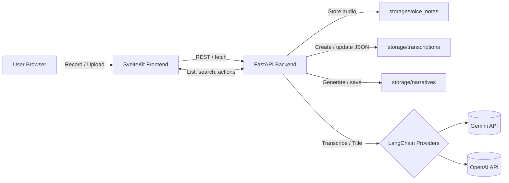

# Narrative Hero

A web app to capture voice notes and turn them into organized, searchable narratives. Notes are automatically transcribed and titled (Gemini via LangChain, with OpenAI fallbacks), stored as lightweight JSON, and can be combined into narratives or used to generate new ones with an LLM.

## Quick Start (TL;DR)

- Backend env: create `backend/.env` with your API keys (example below). At minimum set `GOOGLE_API_KEY`.
- First-time backend setup: `cd backend && python3 -m venv venv && source venv/bin/activate && pip install -r requirements.txt`
- Dev mode:
  - Option A: from the repo root run `./dev.sh` (auto-picks a free Vite port, ensures frontend deps/ backend venv exist, and starts both servers)
  - Option B: run them manually — backend command above in one terminal, `cd frontend && npm install && npm run dev` in another
  - App: open `http://localhost:5173`
- Docker (all-in-one): `docker compose up --build` then open `http://localhost` (backend at `http://localhost:8000`).
- Add notes: click Upload (Topbar), drag & drop audio anywhere, use Start Recording, or click New Text Note to paste an existing transcript.
- Expand/collapse text: click the ▼/▲ toggle within a note card. You can also switch views (List/Compact/Grid) from the Topbar.
- API docs: FastAPI Swagger UI is available at `http://localhost:8000/docs`.

## Features

- Voice capture and uploads: record in-browser or upload `.wav`, `.mp3`, `.ogg`, `.webm`, `.m4a`; video files like `.mkv`/`.mp4` are accepted and converted to audio automatically
- Auto transcription and titles: Gemini 2.5 Flash via LangChain (key rotation)
- Resilient providers: rotate multiple Gemini keys and fallback to OpenAI Whisper/Chat
- JSON metadata per note: title, transcription, date, duration, topics, tags
- Filtering & search: by date range, topics, duration, and free-text query
- Tags: add your own color-coded tags (with last-used color remembered)
- Bulk actions: delete selected notes, create narratives from selection
- Narratives: list, open, delete, assign folders; generate or iterate with formats
- Cross-device audio: WebM/Ogg recordings are normalized to WAV so notes play back on iOS/Safari (requires FFmpeg, already bundled in Docker).

## How It Works

- Record or upload audio in the browser, or create a text-only note.
- Frontend sends requests to the FastAPI backend (`/api/notes`, `/api/notes/text`).
- Backend saves audio to `storage/voice_notes/` and creates/updates JSON in `storage/transcriptions/`.
- Transcription/title run in the background: primary Gemini via LangChain (key rotation) with OpenAI fallbacks when configured.
- Frontend fetches notes and narratives; you can group by folders, tag notes, and generate narratives from selections.
  - Video uploads (e.g., `.mkv`) are accepted; backend extracts audio to `.wav` before processing.



## Data & Layout

- Storage (local by default):
  - `storage/voice_notes/` — uploaded/recorded audio
  - `storage/transcriptions/` — one JSON per note (metadata + text)
  - `storage/narratives/` — generated narratives (`.txt`)
  - `storage/formats/` — saved generation formats (JSON)
  - `storage/folders/` — folders registry (JSON)
- Frontend dev server: `http://localhost:5173`
- Narratives page: `http://localhost:5173/narratives`
- Backend dev server: `http://localhost:8000`
- Docker: frontend on `:80`, backend on `:8000`
- Compose volumes: entire `/app/storage` bind‑mounted from host. Set `STORAGE_DIR` to an absolute
  path on your VPS (recommended) or let it default to `./storage` in the repo.
  - Example: `export STORAGE_DIR=/var/lib/narrative-hero && docker compose up --build`
  - Data lives under `$STORAGE_DIR` and persists across pulls/rebuilds

## Tech Stack

- Frontend: SvelteKit (TypeScript)
- Backend: FastAPI (Python) + LangChain (Gemini/OpenAI)
- Containerization: Docker, Docker Compose

## Prerequisites

- Docker and Docker Compose (optional)
- Node.js 18+ and npm (frontend)
- Python 3.10+ and pip (backend)
  - macOS: install via Homebrew (`brew install python@3.11`) or pyenv (`pyenv install 3.11.10`)
  - Ubuntu/Debian: `sudo apt-get install -y python3.11 python3.11-venv`
- API keys: Google AI (Gemini). Optional: OpenAI (fallbacks)
- FFmpeg for local dev if you plan to upload non‑WAV audio or video files (Docker image already includes it)

Install FFmpeg locally (examples):

- macOS (Homebrew): `brew install ffmpeg`
- Ubuntu/Debian: `sudo apt-get update && sudo apt-get install -y ffmpeg`
- Windows (Chocolatey): `choco install ffmpeg`

## Running the Project

### Production (using Docker)

This is the recommended way to run the project.

1.  **Clone the repository:**
    ```bash
    git clone <repository-url>
    cd narritive-hero
    ```

2.  **Create `backend/.env`:**
   At minimum provide `GOOGLE_API_KEY`. Example:
    ```ini
    # backend/.env
    # Primary Gemini key
    GOOGLE_API_KEY="your-gemini-key-A"
    # Optional extra Gemini keys for rotation
    GOOGLE_API_KEY_1="your-gemini-key-B"
    GOOGLE_API_KEY_2="your-gemini-key-C"
    GOOGLE_API_KEY_3="your-gemini-key-D"

    # Optional: OpenAI fallback (LangChain)
    OPENAI_API_KEY="your-openai-key"

    # Optional: override models
    # Default target is Gemini 2.5 Flash. You can specify human-friendly names
    # (e.g., "gemini 2.5 flash" or "gemini-2.5-flash-002"); the backend
    # normalizes spaces and strips explicit version suffixes.
    # If you need an exact model id (no normalization), set GOOGLE_MODEL_EXACT.
    # GOOGLE_MODEL="gemini 2.5 flash"
    # GOOGLE_MODEL_EXACT="gemini-2.5-flash"
    # OPENAI_TRANSCRIBE_MODEL="whisper-1"
    # OPENAI_TITLE_MODEL="gpt-4o-mini"
    # OPENAI_NARRATIVE_MODEL="gpt-4o"
    ```

3.  **Build and run the application with Docker Compose:**
    ```bash
    # Compose V2 syntax
    docker compose up --build
    # (Older Docker installs may use: docker-compose up --build)
    ```

4.  **Access the application:**
    The frontend will be available at `http://localhost`.
    - Backend API: `http://localhost:8000` (FastAPI docs at `http://localhost:8000/docs`)
    - Ports: frontend `80`, backend `8000` (see `compose.yaml`)

### Local Development

For development, you can run the frontend and backend services separately, or use the root helper script to run both.

#### Backend

1.  **Navigate to the backend directory:**
    ```bash
    cd backend
    ```

2.  **Create or edit `.env` (see example above).**

3.  **Create a virtualenv (first time only):**
    ```bash
    python3 -m venv venv
    source venv/bin/activate
    pip install -r requirements.txt
    ```

4.  **Run the development server:**
    ```bash
    # Option A: use the helper script (expects an existing venv)
    ./dev.sh

    # Option B: run directly with uvicorn
    uvicorn main:app --host 0.0.0.0 --port 8000 --reload
    ```
    The helper script assumes you've already created `backend/venv`; it activates it, installs dependencies, and starts the backend at `http://localhost:8000`.

Windows tips:
- Creating a venv: `py -3 -m venv venv && venv\\Scripts\\activate`
- Running Uvicorn: `uvicorn main:app --host 0.0.0.0 --port 8000 --reload`

#### Frontend

1.  **Navigate to the frontend directory:**
    ```bash
    cd frontend
    ```

2.  **Install dependencies:**
    ```bash
    npm install
    ```

3.  **Run the frontend development server:**
    ```bash
    npm run dev
    ```
    The frontend will be available at `http://localhost:5173`.

#### Run both (convenience)

From the repo root you can start both dev servers together:

```bash
./dev.sh
```
Prereqs: create `backend/.env` and ensure Python 3.10+ is available (macOS usually ships 3.9; install Python 3.11 via Homebrew `brew install python@3.11`, or use pyenv). The script picks the first free Vite port starting at `5173`, ensures the frontend has `node_modules`, ensures a backend virtualenv exists (creating it on the fly if needed), exports matching CORS origins, installs/updates deps, and runs both servers until you press Ctrl+C. If a port is stuck, `./stop-dev.sh` kills the default dev ports (`5173` / `8000`). To point the helper at a custom interpreter (e.g., pyenv shim), run `PYTHON_BIN=$(pyenv which python) ./dev.sh`.

Need to hit the dev UI from another device (phone/tablet)? Start the helper with:

```bash
EXTERNAL_DEV_ORIGIN=http://<laptop-ip>:5173 ./dev.sh
```

The frontend dev server already listens on `0.0.0.0`, so visiting `http://<laptop-ip>:5173` from the same LAN works once CORS knows about your external origin. Replace `<laptop-ip>` with the address of your machine (e.g., `192.168.1.50`). On macOS you can grab it with `ipconfig getifaddr en0`; on Linux use `hostname -I`.

## Project Structure

- `frontend/` SvelteKit app (components for filters, bulk actions, notes, etc.)
- `backend/` FastAPI app
  - `config.py` central paths and env
  - `providers.py` Gemini/OpenAI helpers (rotation + fallbacks)
  - `note_store.py` JSON read/write and metadata helpers
  - `services.py` lean business logic (transcribe/title + notes listing)
  - `main.py` API routes
- `storage/` consolidated app data
  - `storage/voice_notes/` source audio (e.g., `.wav`, `.mp3`)
  - `storage/transcriptions/` one JSON per note (see schema below)
  - `storage/narratives/` saved narratives as `.txt`
  - `storage/formats/` saved generation formats (JSON)
  - `storage/folders/` folders registry (JSON)
- `compose.yaml` Docker Compose services

Notes:
- In Docker, the frontend is served as static files via Nginx and the browser calls the backend at `http://localhost:8000` directly (published from the backend container). No proxy is required.
- All storage subfolders (`voice_notes`, `transcriptions`, `narratives`, `formats`, `folders`) are volume‑mapped by default (see `compose.yaml`). Backend startup ensures these folders exist, and `config.py` can relocate them by setting `STORAGE_DIR`.

## Environment Variables

Backend reads from `backend/.env`. Compose now also loads the repo root `.env` for backend, so you can put production values there too. Common keys:

- `GOOGLE_API_KEY`, `GOOGLE_API_KEY_1..3` — Gemini API keys (rotation supported)
- `GOOGLE_MODEL` — optional model override (normalized, e.g. `gemini 2.5 flash`)
- `GOOGLE_MODEL_EXACT` — exact Gemini model id (disables normalization)
- `OPENAI_API_KEY` — optional fallback for Whisper/Chat
- `OPENAI_TRANSCRIBE_MODEL` — default `whisper-1`
- `OPENAI_TITLE_MODEL` — default `gpt-4o-mini`
- `OPENAI_NARRATIVE_MODEL` — default `gpt-4o`
- `ALLOWED_ORIGINS` — comma‑separated list of frontend origins for CORS (e.g., `https://app.example.com,https://www.example.com`). Can be set in `backend/.env` or root `.env`.
- `ALLOWED_ORIGIN`, `ALLOWED_ORIGIN_1..N` — optional individual CORS entries (take precedence over `ALLOWED_ORIGINS`).

Frontend config: `frontend/src/lib/config.ts` → `BACKEND_URL` (uses `VITE_BACKEND_URL` at build, or computes `http(s)://<current-host>:8000` at runtime if unset).
You can set `VITE_BACKEND_URL` at build time to point the frontend at your API (e.g., `https://api.example.com`).

Docker Compose passes `VITE_BACKEND_URL` as a build arg to the frontend image, and loads backend env from both `backend/.env` and root `.env`:

```yaml
frontend:
  build:
    context: ./frontend
    args:
      - VITE_BACKEND_URL=${VITE_BACKEND_URL:-http://localhost:8000}
backend:
  env_file:
    - ./backend/.env
    - ./.env
```
Set `VITE_BACKEND_URL` in your shell before `docker compose up --build`, or in an `.env` file next to `compose.yaml`.

Security note:
- This app has no authentication out of the box. For production use, deploy the backend behind an authenticated proxy or add auth at the API level.
- Always set `ALLOWED_ORIGINS` to your frontend origin(s) in production to avoid permissive CORS.
- Keep `./storage/*` volumes private; they contain your recordings, transcripts, and generated narratives.

## Note JSON Schema

Each audio file `storage/voice_notes/<base>.<ext>` has `storage/transcriptions/<base>.json`:

```json
{
  "filename": "20250923_140154.wav",
  "title": "Quick standup notes",
  "transcription": "We discussed…",
  "date": "2025-09-23",
  "created_at": "2025-09-23T14:01:54.123456",
  "created_ts": 1758636114123,
  "length_seconds": 42.5,
  "topics": ["standup", "team", "progress"],
  "language": "en",
  "folder": "",
  "tags": [{ "label": "work", "color": "#3B82F6" }]
}
```

Only JSON files are considered for existing notes. Legacy `.txt`/`.title` files are ignored.

Sorting notes: the UI sorts by most recent using `created_ts`/`created_at` when present, with `date` as a fallback. New and backfilled notes include these precise timestamps automatically (derived from audio file mtime or JSON mtime).

<!-- duplicate Testing section removed; consolidated below -->

## Backend Behavior

- Transcription providers
  - Primary: Gemini via LangChain (key rotation on 429/quota)
  - Fallback: LangChain OpenAI Whisper/Chat (when configured)
- Startup backfill (non-blocking)
  - Creates JSON for audio files lacking one
  - Does not re-transcribe if JSON exists (delete JSON to force refresh)
  - Backfills metadata (topics, tags, folder, language) into existing JSONs so sorting/filtering work consistently
- Usage logging
  - Daily JSONL and weekly JSON in `backend/usage/` (git-ignored)

## API Overview

- Notes
  - GET `/api/notes` → list with metadata (title, transcription, date, length, topics, tags)
  - POST `/api/notes` (multipart: `file`) → save audio; transcribe/title in background
  - POST `/api/notes/text` (JSON: `{ transcription, title?, folder?, date?, tags? }`) → create a text-only note (no audio). If `title` is omitted, the backend generates one via Gemini with OpenAI fallback.
  - POST `/api/notes/{filename}/retry` → requeue background transcribe/title for an existing note
  - DELETE `/api/notes/{filename}` → delete audio + JSON
  - PATCH `/api/notes/{filename}/tags` → `{ "tags": [{"label":"…","color":"#…"}] }`
  - PATCH `/api/notes/{filename}/folder` → `{ "folder": "…" }` assign or clear a folder
- Narratives
  - GET `/api/narratives` → list filenames
  - GET `/api/narratives/{filename}` → `{ content, title? }`
  - DELETE `/api/narratives/{filename}`
  - POST `/api/narratives` → body `[{"filename":"…wav"}, …]` creates concatenated narrative (simple join)
  - POST `/api/narratives/generate` → generate via LLM (auto-titles narrative and saves metadata)
    - Body: `{ items: [{ filename: "…wav" }], extra_text?: string, provider?: "auto"|"gemini"|"openai", model?: string, temperature?: number, system?: string }`
    - Includes each note's `date` alongside its `title` and text in the prompt context.
    - Uses Gemini (with key rotation) by default and falls back to OpenAI when `provider=auto`.
  - GET `/api/narratives/list` → list `{ filename, title?, folder }` for all narratives
  - GET `/api/narratives/thread/{filename}` → return version thread for a narrative `{ files, index }`
  - PATCH `/api/narratives/{filename}/folder` → set a folder for a narrative `{ folder }`
  - GET `/api/narratives/folders` → list narrative folders `{ name, count }`

- Formats (optional saved prompts for generation)
  - GET `/api/formats` → list saved formats `{ id, title, prompt }`
  - POST `/api/formats` → create/update `{ title, prompt, id? }` → `{ id }`
  - DELETE `/api/formats/{id}` → remove a saved format

- Folders
  - GET `/api/folders` → list `{ name, count }`
  - POST `/api/folders` → create `{ name }`
  - DELETE `/api/folders/{name}` → remove folder and delete notes within

- Static
  - `/voice_notes/{filename}` → serves uploaded audio files
  - `/api/models` → suggest chat models `{ models: string[] }` (query: `provider=auto|gemini|openai`, `q=...`). Returns the latest big and small models per provider (auto returns both providers).

Open API docs: visit `http://localhost:8000/docs`.
  

## Frontend Highlights

- FiltersBar: date range, topics, min/max seconds, search; Reset and result count
- BulkActions: bottom floating bar for Delete Selected and Create Narrative
- NoteItem: tag chips with compact color picker, preview snippet, expand/collapse
- Config: `frontend/src/lib/config.ts` hosts `BACKEND_URL`
- Narrative model picker: searchable selector with live suggestions from `/api/models` (auto-updates from provider catalogs when keys are configured; shows latest big and small from each provider)

Default `BACKEND_URL` is `http://localhost:8000`. When using Docker Compose, this is correct because requests originate from the browser, not inside the container. Use the top bar “Narratives” to open the full narratives page.

## Troubleshooting

- Can’t expand text? Click the ▼ button inside the note card to toggle the full transcription. In Compact view, the same toggle applies per note.
- Upload works but no text appears: transcription runs in the background; refresh after a moment. If it failed, try “Retry” via `POST /api/notes/{filename}/retry` or re-upload.
- 429/quota errors: the backend rotates Gemini keys automatically and falls back to OpenAI when configured.
- Ports busy: adjust mappings in `compose.yaml`, rerun `./dev.sh` (it auto-picks a free Vite port), or use `./stop-dev.sh` to clear default dev ports.
- Non‑WAV audio and video-to-audio extraction require FFmpeg at runtime (Docker image installs FFmpeg; for local dev, install it via your OS package manager).
- Backend script exits complaining about Python 3.9: install Python 3.10+ (see prerequisites) and rerun `PYTHON_BIN=/path/to/python ./dev.sh`.
- CORS blocked in production: set `ALLOWED_ORIGINS` in `backend/.env` to your deployed frontend origin(s), e.g., `ALLOWED_ORIGINS=https://app.example.com`.
- Frontend calling the wrong API host: rebuild the frontend with `VITE_BACKEND_URL` set to your API origin (e.g., `export VITE_BACKEND_URL=https://api.example.com && docker compose up --build`).

## Frontend Notes

Some legacy components/exports are present and appear unused based on a static search of imports/references in `frontend/src`.

- Components
  - `frontend/src/lib/components/FileUpload.svelte` — superseded by the Topbar upload button and `pageDrop` action.
  - `frontend/src/lib/components/FolderSidebar.svelte` — replaced by folder chips/cards within `NotesList.svelte`.
  - `frontend/src/lib/components/RecordingControls.svelte` — replaced by `Topbar.svelte` and `uiApp` store actions.
- Unused exports (safe to keep, but not referenced)
  - `frontend/src/lib/services/appActions.ts: deleteNotes`
  - `frontend/src/lib/stores/notes.ts: notesActions.refresh`
  - `frontend/src/lib/stores/folders.ts: folderActions.refresh`

Notes
- Detection method: static search across `frontend/src`.
- Caveat: dynamic usage (code-splitting or string imports) would not be detected.
- If you want, we can remove these in a follow‑up cleanup.

<!-- Former experimental route (LangHero) has been removed from this app; scenario functionality lives in a separate project and is not required here. -->

<!-- duplicate Testing/Troubleshooting sections removed; content merged into single sections -->

## Tips

- Use multiple Gemini keys to smooth through quota spikes
- Add OpenAI key for reliable fallback
- To reprocess a note, delete its JSON; backend will recreate it on startup or next upload
- FFmpeg with pydub improves audio format handling (Docker installs FFmpeg; add it locally if needed)

## Testing

- Location and structure
  - All test files and scripts live under `tests/`.
  - Backend: `tests/backend/tests/…` (pytest tests), `tests/backend/test.sh` (runner), `tests/backend/run_smoke_tests.py` (no-deps smoke).
  - Config and dev deps: `tests/backend/pytest.ini`, `tests/backend/requirements-dev.txt`.
  - Tests create temp dirs and stub external providers; no real API calls.

- Quick run
  - `bash tests/backend/test.sh` creates/activates a local venv if possible, runs pytest when available, and falls back to smoke tests when offline.
  - Or use Make from within `tests/`: `make -C tests test`.

- Full backend pytest
  - `bash tests/backend/setup_venv.sh`
  - `source tests/backend/.venv/bin/activate`
  - `PYTHONPATH=backend pytest -q tests/backend`

- Run everything
  - `bash tests/run_all.sh` runs backend tests, then frontend tests if available.

## Amnesia-Friendly Shortcuts

- Name vs folder: repository folder is `narritive-hero`, app name is “Narrative Hero”. Typos are intentional in folder name; don’t rename unless updating Compose, docs, and external links.
- Local dev (fast):
  - Terminal A: `cd backend && python3 -m venv venv && source venv/bin/activate && pip install -r requirements.txt && uvicorn main:app --host 0.0.0.0 --port 8000 --reload`
  - Terminal B: `cd frontend && npm install && npm run dev`
  - App: `http://localhost:5173` (API: `http://localhost:8000`)
- All-in-one: `docker compose up --build` → open `http://localhost`
- Force reprocess a note: delete its JSON in `storage/transcriptions/<base>.json` and refresh. Or `POST /api/notes/{filename}/retry`.
- Can’t find audio? Files live in `storage/voice_notes/`; waveforms stream from `/voice_notes/{filename}`.
- FFmpeg missing locally? Install via OS package manager; Docker image already includes it.

## Mental Model (1-minute)

- Source of truth: one JSON per note in `storage/transcriptions/` (metadata + text). Audio is optional for text-only notes.
- Jobs: upload/record triggers background transcription + title. Gemini 2.5 Flash via LangChain with key rotation; OpenAI is a fallback.
- UI: SvelteKit consumes REST endpoints, filters in memory, and manages tags/folders client-side while persisting via PATCH routes.
- Narratives: plain `.txt` under `storage/narratives/` with optional metadata JSON. UI can generate/iterate via `/api/narratives/generate`.

## Daily Dev Workflow

- Bootstrap:
  - Ensure `backend/.env` exists (see example above). At minimum set `GOOGLE_API_KEY`.
  - Start backend and frontend (see shortcuts above).
- Iterate:
  - Backend change → hot reload via Uvicorn.
  - Frontend change → Vite hot reload.
- Test quickly:
  - `bash tests/backend/test.sh` (uses a local venv if available, falls back to smoke tests when offline).
  - Smoke only: `python3 tests/backend/run_smoke_tests.py`.

## When Something Breaks

- 401/403 from API: missing or invalid keys in `backend/.env`.
- 429s from Gemini: keys rotate automatically; consider adding more `GOOGLE_API_KEY_1..3`. OpenAI key enables fallback.
- CORS errors in prod: set `ALLOWED_ORIGINS` in `backend/.env` to deployed frontend origins.
- Frontend pointed to wrong API: rebuild with `VITE_BACKEND_URL` set, or edit `frontend/src/lib/config.ts` for local dev.
- Nothing transcribing: check logs in backend console; verify FFmpeg exists for non‑WAV/video inputs.
- Windows + WSL path issues: ensure your `./storage/*` directories are on the Linux filesystem, not a mounted Windows drive, to avoid permission quirks.

## Extending the Backend (cheat sheet)

- Add route: edit `backend/main.py` and define a FastAPI handler. Keep business logic in `services.py` and persistence in `note_store.py`.
- Persist metadata: read/write via `note_store.save_note_json()` to keep schema consistent.
- Use LLMs: via helpers in `providers.py` (`invoke_google`, `openai_chat`, `transcribe_with_openai`).
- Config: add env in `backend/config.py`; document new keys in this README (Env & Secrets section).
- Startup tasks: non-blocking backfill logic lives in `utils.py:on_startup()` and is invoked from `main.py`.

## Extending the Frontend (cheat sheet)

- API base: `frontend/src/lib/config.ts` (`BACKEND_URL` / `VITE_BACKEND_URL`).
- Call API: add helpers in `frontend/src/lib/api.ts` or in a specific service under `frontend/src/lib/services/`.
- UI patterns: build small components in `frontend/src/lib/components/`; wire screens in `routes/` (e.g., `routes/narratives`).
- State: lightweight stores in `frontend/src/lib/stores/` for notes, folders, durations, etc.
- Upload UX: Topbar handles upload/record/new text note; page-wide drag & drop handled by a `pageDrop` action.

## Data Lifecycle Cheatsheet

- Upload/Record → `storage/voice_notes/<base>.<ext>` created.
- Background job → transcribe + title → `storage/transcriptions/<base>.json` created/updated with metadata (topics/tags/folder/language backfilled).
- Delete a note → removes audio and its JSON.
- Narrative → `.txt` saved to `storage/narratives/` (+ metadata JSON sidecar for title/folder/thread).
- Formats → saved to `storage/formats/` and listed via `/api/formats`.
- Folders → tracked in `storage/folders/` and in note/narrative metadata.

## Env & Secrets (quick map)

- Backend (`backend/.env`):
  - `GOOGLE_API_KEY`, `GOOGLE_API_KEY_1..3` for Gemini; rotation on 429.
  - `OPENAI_API_KEY` for fallback.
  - Optional model overrides: `GOOGLE_MODEL`, `GOOGLE_MODEL_EXACT`, `OPENAI_*_MODEL`.
  - `ALLOWED_ORIGINS` for CORS in prod.
- Frontend build arg: `VITE_BACKEND_URL` (Compose passes it; browser fetches API directly).

## Release/Deploy

- Local Docker: `docker compose up --build` → visit `http://localhost`.
- Config before build: set `VITE_BACKEND_URL` to public API URL if not default.
- Persistence: host volumes map to `./storage/*` so local data survives rebuilds.
- Static frontend: the Dockerized frontend builds to static assets served by Nginx (see `frontend/nginx.conf`). The browser talks directly to the backend at `:8000`.

## Gotchas

- Folder name typo is intentional: `narritive-hero` vs app name “Narrative Hero”. Scripts and docs assume this path.
- Text-only notes skip audio; they still get auto titles if omitted.
- Backfill doesn’t re-transcribe existing JSONs; delete the JSON to force refresh.
- Provider catalogs for `/api/models` are best-effort and cached briefly; exact model names can be supplied in requests if needed.

## Glossary

- Note: a single item with `title`, `transcription`, optional `audio`, and metadata.
- Narrative: a `.txt` composed from notes (either concatenated or LLM-generated/iterated) with optional metadata.
- Format: saved prompt template for narrative generation.
- Folder: lightweight grouping for notes and narratives.

## Quick File Map

- Backend
  - `backend/main.py` routes and glue
  - `backend/services.py` core operations (transcribe/title, list, generate)
  - `backend/note_store.py` JSON schema + persistence helpers
  - `backend/providers.py` LLM providers and fallbacks
  - `backend/config.py` environment and model normalization
  - `backend/utils.py` startup tasks, async helpers
  - `backend/usage_log.py` local usage telemetry (git-ignored outputs in `backend/usage/`)
- Frontend
  - `frontend/src/lib/config.ts` backend URL
  - `frontend/src/lib/api.ts` basic API client
  - `frontend/src/lib/components/topbar/Topbar.svelte` capture controls + view toggles
  - `frontend/src/lib/components/NoteItem.svelte` note card with tags and audio
  - `frontend/src/routes/narratives/+page.svelte` narratives screen
- Orchestration
  - `compose.yaml` services; volumes map to `./storage/*`
  - `dev.sh` convenience launcher for both dev servers

## FAQ

- Why JSON instead of a database? Simplicity, portability, and easy diffing; performance is sufficient for the intended scale. Can be swapped later.
- How to change default models? Set `GOOGLE_MODEL` for normalized name or `GOOGLE_MODEL_EXACT` for a fixed id; OpenAI models via `OPENAI_*_MODEL`.
- Can I bring my own provider? Yes—add a provider function in `providers.py`, branch in `generate_narrative`, and update UI pickers.

## Contributing

- Fork and clone the repo. The folder name is intentionally `narritive-hero`.
- For local dev, run the backend and frontend as described in Quick Start.
- Run backend tests: `bash tests/backend/test.sh` (falls back to smoke tests if pytest isn’t available).
- Open a PR with a clear description of the change and any user‑visible effects.
